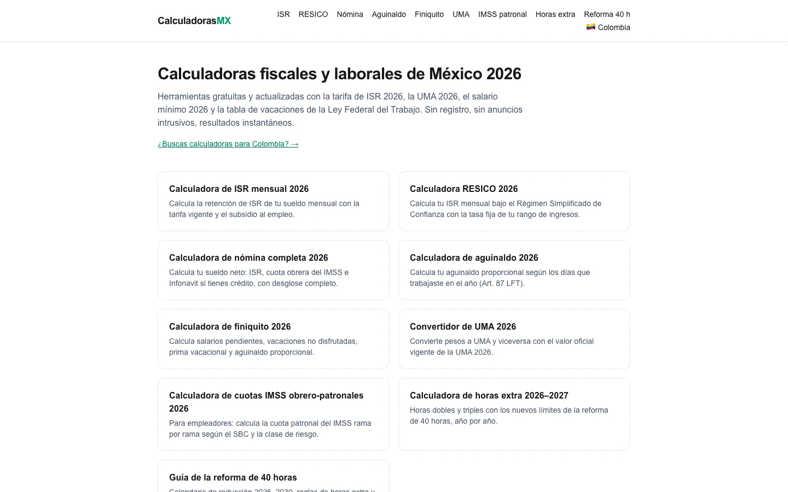
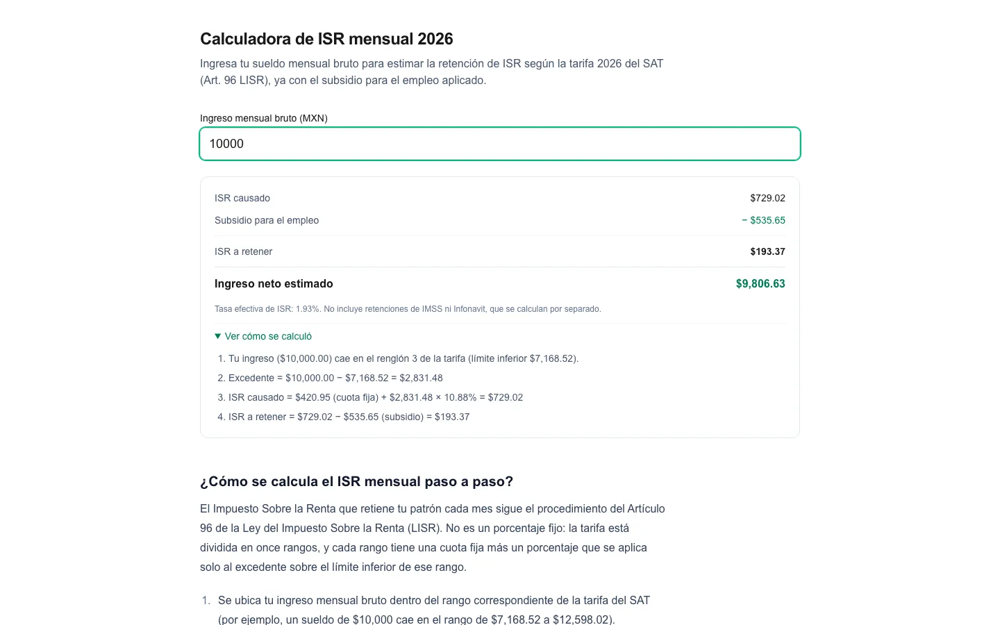

# Calculadoras MX

**English** | [Español](README.es.md)

Open-source tax & labor calculators for Latin America (Mexico, Colombia).

**Live site: [calculadoras-mx.netlify.app](https://calculadoras-mx.netlify.app)**

[](https://github.com/DiegoTepichin/calculadoras-mx/actions/workflows/ci.yml?query=branch%3Amain)
[](LICENSE)
[](https://nextjs.org)





Every calculator shows its result **and** the formula with your numbers substituted in
("Ver cómo se calculó"), so anyone can check the math against the law it cites.

## Calculators

### Mexico 🇲🇽

| Calculator | Route | Legal basis |
|---|---|---|
| Monthly income tax (ISR) + employment subsidy | [`/calculadora/isr`](https://calculadoras-mx.netlify.app/calculadora/isr) | Art. 96 LISR, subsidio para el empleo decree |
| RESICO (simplified trust regime) | [`/calculadora/resico`](https://calculadoras-mx.netlify.app/calculadora/resico) | Art. 113-E LISR |
| Full payroll (net pay: ISR + IMSS + Infonavit) | [`/calculadora/nomina`](https://calculadoras-mx.netlify.app/calculadora/nomina) | LISR, LSS |
| Christmas bonus (aguinaldo) | [`/calculadora/aguinaldo`](https://calculadoras-mx.netlify.app/calculadora/aguinaldo) | Art. 87 LFT |
| Severance on voluntary separation (finiquito) | [`/calculadora/finiquito`](https://calculadoras-mx.netlify.app/calculadora/finiquito) | Arts. 76, 80, 87 LFT |
| UMA converter | [`/calculadora/uma`](https://calculadoras-mx.netlify.app/calculadora/uma) | INEGI |
| IMSS employer & employee contributions | [`/calculadora/imss-patronal`](https://calculadoras-mx.netlify.app/calculadora/imss-patronal) | LSS, Infonavit Law |
| Overtime under the 40-hour workweek reform | [`/calculadora/horas-extra`](https://calculadoras-mx.netlify.app/calculadora/horas-extra) | Arts. 61, 66, 68 LFT (DOF 2026-05-01) |
| Guide: 40-hour workweek reform | [`/reforma-40-horas`](https://calculadoras-mx.netlify.app/reforma-40-horas) | DOF 2026-05-01 |

### Colombia 🇨🇴

| Calculator | Route | Legal basis |
|---|---|---|
| Withholding tax for employees (retención en la fuente) | [`/co/calculadora/retencion`](https://calculadoras-mx.netlify.app/co/calculadora/retencion) | Art. 383 Estatuto Tributario |
| Service bonus (prima de servicios) | [`/co/calculadora/prima`](https://calculadoras-mx.netlify.app/co/calculadora/prima) | Art. 306 CST |
| UVT converter | [`/co/calculadora/uvt`](https://calculadoras-mx.netlify.app/co/calculadora/uvt) | DIAN resolution |

## How the numbers are verified

A tax calculator is only as good as its numbers, so the data layer follows strict rules:

1. **One source of truth per year.** Every rate, bracket and threshold lives in a plain,
   year-suffixed TypeScript constant in [`data/`](data) (`isr-2026.ts`, `imss-2026.ts`,
   `co/retencion-2026.ts`…). Nothing is scraped or fetched at runtime.
2. **Official source cited in the file.** Each data file starts with the law, decree or
   resolution it comes from (SAT, DOF, INEGI, CONASAMI, DIAN…). The full list, with validity
   dates and review cadence, is in [`docs/DATA_SOURCES.md`](docs/DATA_SOURCES.md).
3. **Cross-checked against 2–3 independent sources** before being hardcoded, typically the
   official publication plus professional tax/payroll references.
4. **First principles over shortcuts.** When a secondary source publishes a "shortcut" constant
   that can't be verified for internal consistency, the code computes from the official table
   instead (e.g. Colombian withholding iterates every bracket marginally rather than trusting
   pre-summed UVT constants).
5. **Pure, tested calculation code.** All math lives in framework-free functions in
   [`lib/`](lib), each with a [Vitest](https://vitest.dev) suite that pins worked examples
   (bracket boundaries, caps, zero and negative inputs).
6. **Yearly updates add files, never overwrite them.** When the authorities publish new
   tables, a new `*-2027.ts` file is added and imports are repointed, keeping the history
   auditable.

Found a number that doesn't match an official source? Please
[open a "Wrong number" issue](../../issues/new?template=wrong-number.md).

## Stack and why it's fully static

- [Next.js 16](https://nextjs.org) (App Router) + TypeScript + Tailwind CSS 4
- Vitest for unit tests, ESLint, and GitHub Actions CI (lint, type check, tests, build)

Every page is prerendered at build time (`○ Static`): calculations run in the browser from
constants shipped with the page. There is no backend and no database, and the figures you type never
leave your device, which makes the site free to host, fast on low-end phones and trivially cacheable.
Open Graph images are generated at build time too.

## Quickstart

Requires Node.js 20+.

```bash
git clone https://github.com/DiegoTepichin/calculadoras-mx.git
cd calculadoras-mx
npm install
npm run dev        # http://localhost:3000
```

## Tests and checks

```bash
npm run lint       # ESLint
npx tsc --noEmit   # type check
npm run test       # Vitest unit tests for lib/ and data/
npm run build      # production build; every route must stay ○ Static
```

Run a single suite with `npx vitest run lib/isr.test.ts`.

## Project structure

```
data/          yearly tax/labor constants with their official sources (Mexico at the root)
data/co/       Colombia's constants
lib/           pure calculation functions + their *.test.ts files
lib/co/        Colombia's calculations
components/    one client-side form per calculator, plus shared inputs
app/           one route per calculator (Mexico unprefixed, other countries under /<cc>)
```

## Adding a new country

Countries are added one at a time under their ISO 3166-1 alpha-2 code (Colombia lives under
`/co`). In short: add `data/<cc>/` with sourced constants, `lib/<cc>/` with tested functions,
`components/<cc>/` forms, and `app/<cc>/` routes, then register the country in `lib/paises.ts`
and its nav/footer in `components/SiteChrome.tsx`. Shared building blocks (bracket lookup,
inputs, SEO helpers, OG images) are already country-agnostic. See
[CONTRIBUTING.md](CONTRIBUTING.md#adding-a-country) for the full checklist.

## Contributing

Corrections with an official source are the most valuable contribution. See
[CONTRIBUTING.md](CONTRIBUTING.md).

## Disclaimer

This project is **informational only and is not tax, labor or legal advice**. Results are
estimates based on the general rules of each law; your actual payroll can differ because of
contract terms, integrated salary, other income or deductions. Check with a certified
accountant or the relevant authority before making decisions.

## License

[MIT](LICENSE) © Diego Tepichin
